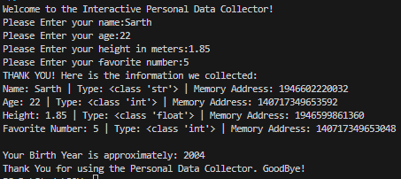

Interactive Personal Data Collector

- A beginner-friendly Python project that collects personal information from the user and demonstrates important Python fundamentals such as variables, data types, type casting, arithmetic operations, formatted strings, and built-in functions.

Project Objective
- The main goal of this project is to help beginners understand how Python handles:
- User input
- Data types
- Variables
- Type casting
- Arithmetic calculations
- Memory addresses
- Built-in functions like type() and id()

Features
- Takes user input using input()
- Converts data into appropriate data types using:
  - int()
  - float()
- Displays:
  - Variable values
  - Data types
  - Memory addresses
- Calculates approximate birth year
- Uses formatted string literals (f-strings)
- Beginner-friendly and easy to understand

Program Workflow
 - Display welcome message
 - Ask the user to enter personal details
 - Store the values in variables
 - Print each value with:
 - Data type
 - Memory address
 - Calculate birth year using the formula:
 - birth_year = 2026 - age
 - Display a goodbye message

Source Code
print("Welcome to the Interactive Personal Data Collector!")

name=input("Please Enter your name:")
age=int(input("Please Enter your age:"))
height=float(input("Please Enter your height in meters:"))
number=int(input("Please Enter your favorite number:"))

birth_year=2026-age
print("THANK YOU! Here is the information we collected:")

print(f"Name: {name} | Type: {type(name)} | Memory Address: {id(name)}")
print(f"Age: {age} | Type: {type(age)} | Memory Address: {id(age)}")
print(f"Height: {height} | Type: {type(height)} | Memory Address: {id(height)}")
print(f"Favorite Number: {number} | Type: {type(number)} | Memory Address: {id(number)}")

print(f"\nYour Birth Year is approximately: {birth_year}")

print("Thank You for using the Personal Data Collector. GoodBye!")

Screenshot

Author
Sarth Thakar